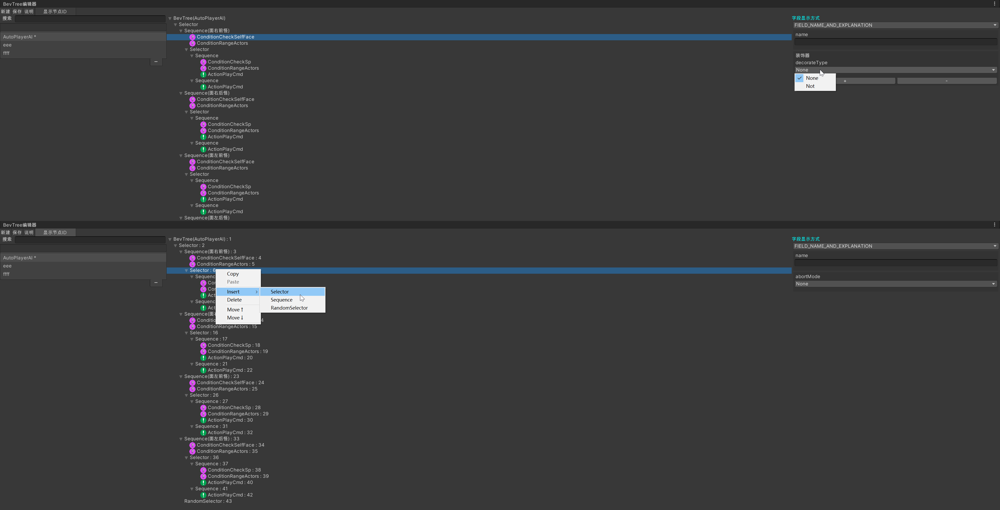
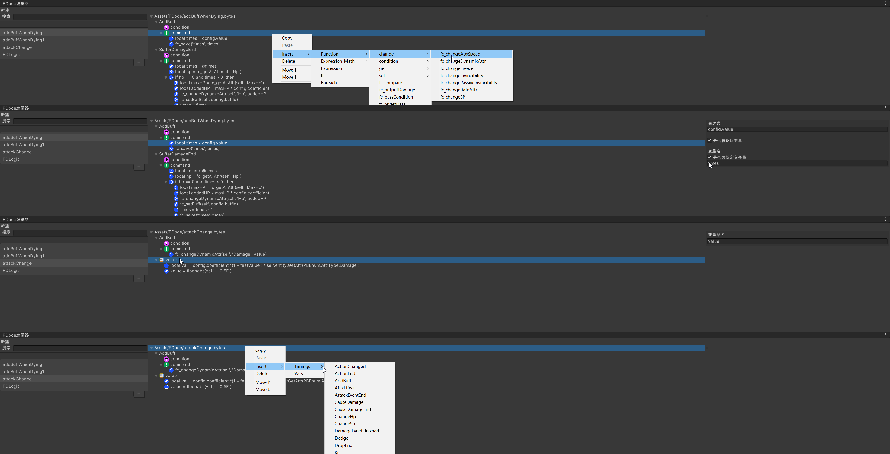

# CodeEditor

## **提供对Lua行为树的节点编辑。**

## **提供对Lua逻辑代码的节点编辑。**

## 使用说明

1. 用Unity的PackageManager将package.json导入

2. 在Proto/Tools文件夹下执行protobuf.py的python脚本，执行完成后会在Proto文件夹下多出一个Generated文件夹，其中包含有BevTree.proto和FCode.proto中的定义。【注意：Tools/bin/下包含有macOS和win的protoc，其他平台需要提供对应的protoc后再使用，而且目前来说没有听过Liunx的Unity编辑器支持，所以对于编辑器应该是够用了的】

3. 修改BevTreeProperty.json中的ConditionsDir、ActionsDir、AIDir、AISnippetDir为适合自己工程的路径。

    - ConditionsDir表示所有Condition节点的Lua脚本所在路径；
    - ActionsDir表示所有Action节点的Lua脚本所在路径；
    - AIDir和AISnippetDir为所有的AI以及SnippetAI脚本文件所在路径，它们也是BevTree编辑器处理的文件。

4. 修改FCodeProperty.json中的LogicDir、FCodeFunctionFile为适合自己工程的路径。

    - LogicDir表示所有FCode脚本文件所在路径，它们也是FCode编辑器处理的文件。
    - FCodeFunctionFile表示FCode脚本依赖的具体逻辑函数库所在路径，它决定了FCode编辑器用来够插入一些什么函数。只有在这个脚本中定义并符合一定规则的函数才能够被FCode编辑器正确解析和反解析。

5. 在Unity的Window菜单栏中找到CodeEditor，其后分别有BevTree和FCode的window。打开后即可正常使用。

## todo-list

1. 运行时BevTree状态查看器；

2. proto文件的外迁；

3. 路径定义的外迁；

4. 部分代码的todo标记；
